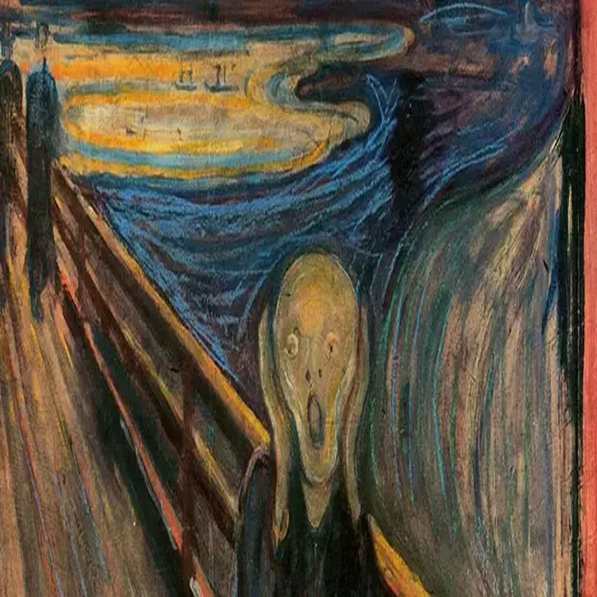

# Seamless Object Transfer Between Images

**Author**: Batuhan Solmaz  
**Institution**: Bogazici University  

---

## Introduction

**Objective**: Transferring objects between images using prompt-based input.  
**Methods**: 
- **SAM (Segment Anything Model)**: For segmentation, extracting precise object masks based on user prompts.
- **Deep Image Blending**: For integration, ensuring realistic alignment.

---

## Methodology

### Deep Image Blending
**Description**: The task is image harmonization.  

#### Stage 1: Seamless Blending  
The blending image is computed as:

$$
I_B = I_Z \odot M + I_T \odot (1 - M)
$$

#### Loss Functions:
1. **Gradient Loss** ($L_{\text{blend}}$):  
   Ensures the gradients of $I_B$ match the gradients of $I_S$ and $I_T$ in the blending region.

2. **Content Loss** ($L_{\text{content}}$):  
   - Compares deep features of $I_Z$ (from VGG) with $I_S$ to preserve the structural information of the source object.
   - Retains the recognizable shape, layout, and meaningful content of the object.

3. **Style Loss** ($L_{\text{style}}$):  
   Matches the style of $I_Z$ with $I_T$ using Gram matrices computed from VGG layers.

4. **Histogram Loss** ($L_{\text{hist}}$):  
   Matches the marginal distributions of feature maps in $I_B$ with those in $I_T$ for each filter at each VGG layer. Stabilizes style transfer (e.g., brightness, contrast, texture intensity).

5. **Total Variation Loss** ($L_{\text{tv}}$):  
   Promotes spatial smoothness in $I_B$ by penalizing large intensity differences between neighboring pixels.

#### Stage 2: Style Refinement  
- Re-optimizing the blending image ($I_B$) with a focus on style losses.
- Higher weight is assigned to **Style Loss** ($L_{\text{style}}$).

The total loss is computed as:

$$
L_{\text{total}} = \lambda_{\text{cont}} L_{\text{cont}} + \lambda_{\text{style}} L_{\text{style}} + \lambda_{\text{hist}} L_{\text{hist}} + \lambda_{\text{tv}} L_{\text{tv}}
$$

---

## Visual Examples

### Example 1: Get a Boat
| **Source Image**         | **Target Image**             | **Result Image**               |
|---------------------------|------------------------------|---------------------------------|
|  |  |  |

### Example 2: Get the Eiffel Tower
| **Source Image**             | **Target Image**               | **Result Image**                   |
|-------------------------------|---------------------------------|-------------------------------------|
|  |  |  |

### Example 3: Get All People
| **Source Image**             | **Target Image**               | **Result Image**                   |
|-------------------------------|---------------------------------|-------------------------------------|
|  |  |  |

### Example 4: Get the Gladiator, Sword, and Shield
| **Source Image**             | **Target Image**               | **Result Image**                   |
|-------------------------------|---------------------------------|-------------------------------------|
|  |  |  |

### Example 5: Get the Balloon
| **Source Image**             | **Target Image**               | **Result Image**                   |
|-------------------------------|---------------------------------|-------------------------------------|
|  |  |  |

### Example 6: Get the Lion on the Left
| **Source Image**             | **Target Image**               | **Result Image**                   |
|-------------------------------|---------------------------------|-------------------------------------|
|  |  |  |

---

## Segment Anything Model (SAM)

### Overview:
- **Image Encoder**: A Vision Transformer (ViT-H), a pre-trained masked autoencoder.
- **Prompt Encoder**: Uses CLIP's encoder for text prompts.
- **Mask Decoder**: Generates segmentation masks with self-attention layers, cross-attention, and MLP layers.

## Loss Functions

- **Focal Loss**:  
  FL(p_t) = -(1 - p_t)ᵞ log(p_t)

- **Dice Loss**:  
  D = (2 × Σ pᵢ gᵢ) / (Σ pᵢ² + Σ gᵢ²)

### Diagrams:
  

---

## Future Work and Conclusion

- Improve blending efficiency for real-time applications.  
- The proposed method successfully integrates SAM and deep image blending to achieve seamless object transfer.

---

## References

1. Kirillov, A., Mintun, E., Ravi, N., et al. (2023). [Segment Anything](https://arxiv.org/abs/2304.02643).  
2. Zhang, L., Wen, T., & Shi, J. (2019). [Deep Image Blending](https://arxiv.org/abs/1910.11495).
